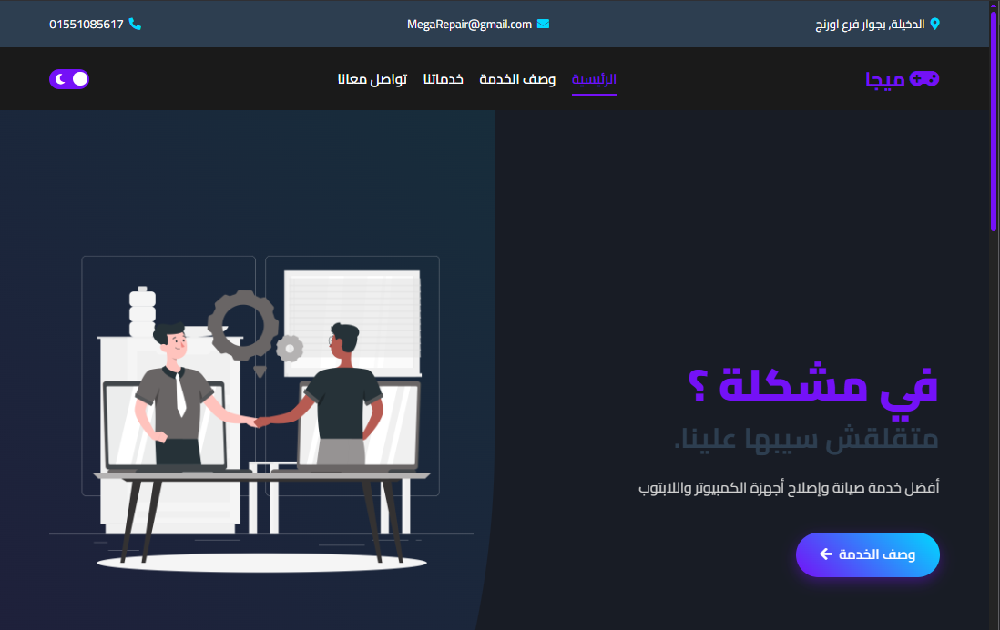

# MEGA NetCafe Website



## Overview

A modern, responsive website for MEGA NetCafe, a computer service and gaming center located in Alexandria, Egypt. The website showcases the company's computer repair services, gaming facilities, and other offerings.

**Live Website:** [MEGA NetCafe](https://msmelok.github.io/mega/)

## Features

- **Responsive Design** - Fully responsive layout that works on mobile, tablet, and desktop devices
- **Bilingual Support** - Arabic interface with RTL (Right-to-Left) layout
- **Dark/Light Mode** - Toggle between light and dark themes
- **SEO Optimized** - Complete with meta tags, structured data, and sitemap
- **Google Analytics** - Integrated tracking for visitor analytics
- **Smooth Animations** - Uses AOS (Animate on Scroll) library for engaging user experience
- **Interactive Elements** - Dynamic navigation, service cards, and contact information

## Technologies Used

- **HTML5** - Semantic markup for better accessibility
- **CSS3** - Modern styling with CSS variables and responsive design
- **JavaScript** - Vanilla JS for interactive elements
- **Google Analytics** - Visitor tracking and analytics
- **Font Awesome** - Icon library for visual elements
- **Google Fonts** - Cairo font family for Arabic text
- **AOS (Animate on Scroll)** - Animation library for scroll-based animations

## Project Structure

```
├── css/
│   └── style.css         # Main stylesheet
├── images/               # Image assets
│   ├── 32x32.png         # Favicon
│   ├── home-img.png      # Home section image
│   ├── about-img.png     # About section image
│   └── service-*.svg     # Service icons
├── js/
│   └── script.js         # Main JavaScript file
├── index.html            # Main HTML document
├── robots.txt            # Search engine crawling instructions
├── sitemap.xml           # XML sitemap for search engines
└── README.md             # Project documentation
```

## SEO Features

- **Meta Tags** - Complete with description, keywords, Open Graph, and Twitter Cards
- **Structured Data** - JSON-LD for Local Business
- **Canonical URLs** - Preventing duplicate content issues
- **Sitemap** - XML sitemap for search engine indexing
- **Robots.txt** - Instructions for search engine crawlers
- **Semantic HTML** - Proper HTML structure for better SEO
- **Mobile Friendly** - Responsive design for mobile SEO
- **Image Alt Text** - Descriptive alt text for all images

## Performance Optimizations

- **Minified Resources** - CSS and JavaScript files are optimized
- **Optimized Images** - Images compressed for faster loading
- **Lazy Loading** - Images and iframe content load as needed
- **Efficient DOM Manipulation** - Minimized DOM operations for better performance
- **CSS & JS Best Practices** - Following modern development guidelines

## Development

- This is not to be used without the approval from MelokMade Innovations,


## Contact

For questions or support, please contact:

- **Email:** MegaRepair@gmail.com
- **Phone:** 01551085612
- **Address:** El-Dekhela, beside Orange Store, Alexandria, Egypt

## Copyright

© 2025 MEGA NetCafe | All rights reserved  
Developed by [MelokMade Innovations](https://msmelok.github.io/R4_2.0/)